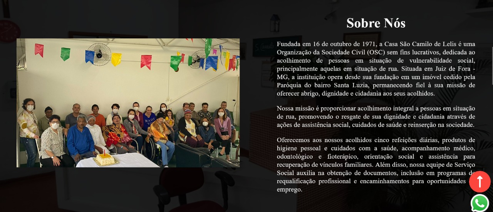
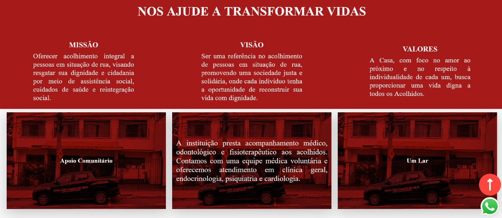
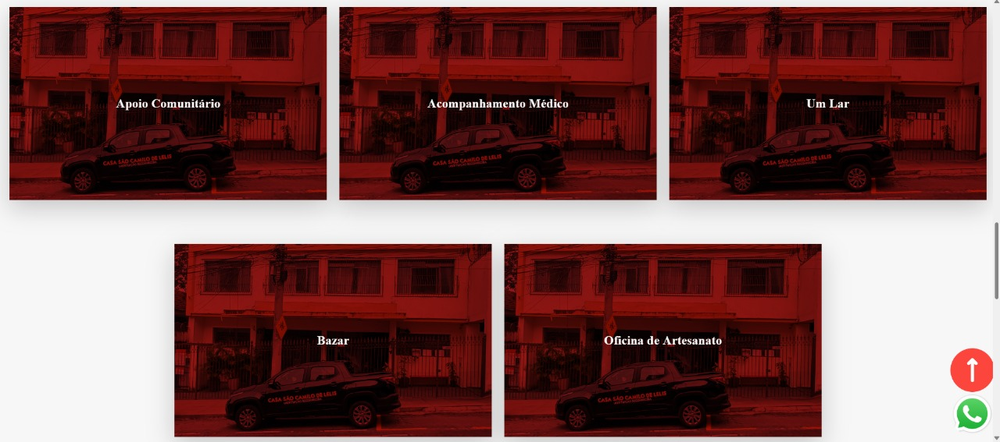
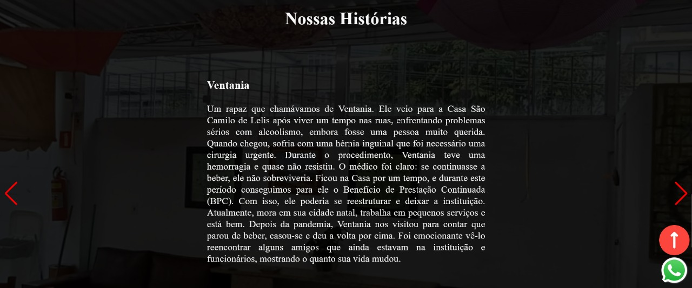
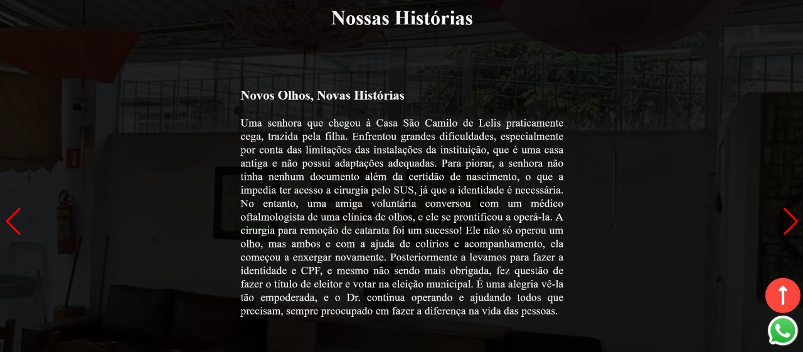
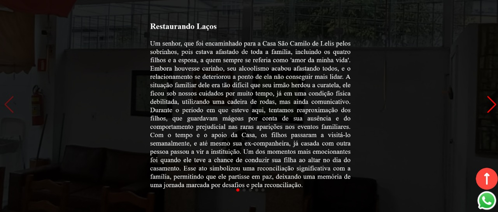
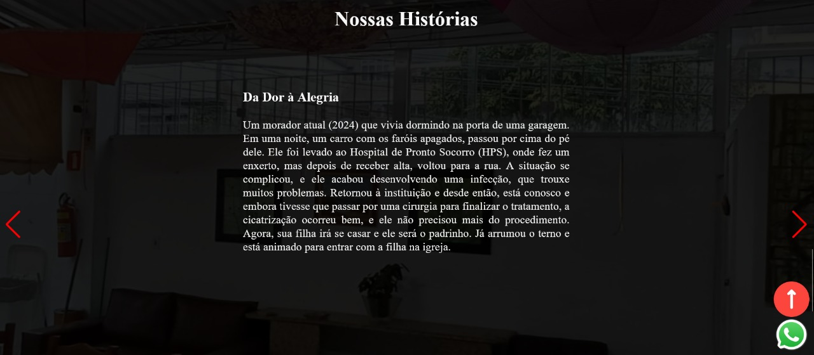
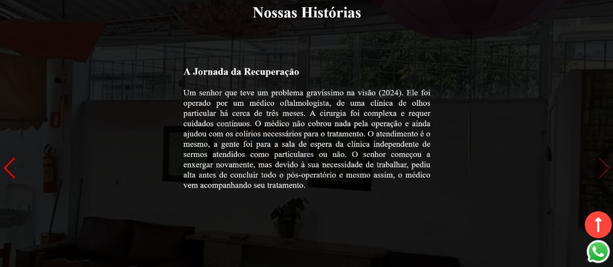
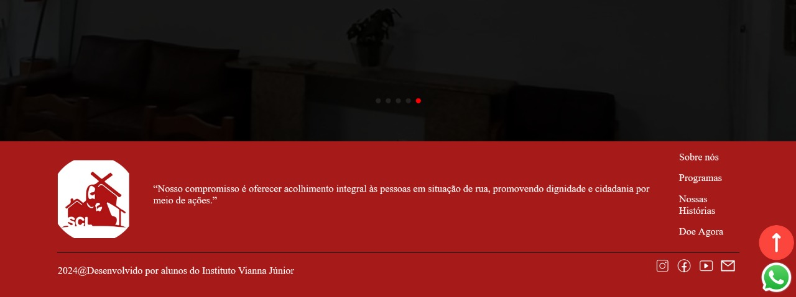

# Projeto Casa São Camilo de Lelis

## 📌 Descrição do Projeto

Desenvolvimento de uma landing page para a Casa São Camilo de Lelis, destacando sua missão, estrutura e conquistas ao longo do tempo. O projeto foi realizado em grupo, com a colaboração de seis estudantes, e incluiu versões para desktop e mobile, garantindo acessibilidade e uma melhor experiência para os visitantes.

Foi utilizado HTML, CSS, JavaScript e React para criar uma interface moderna, responsiva e otimizada para a captação de recursos, auxiliando na continuidade das atividades da instituição.

## 🔗 Site desenvolvido em: https://casacamilodelelis.org

## 📌 Funcionalidades

- ✅ Interface Responsiva: Adapta-se a diferentes tamanhos de tela, garantindo uma boa experiência tanto em dispositivos móveis quanto em desktops.

- ✅ Seção de Doação: Informações claras sobre como contribuir para a instituição.

- ✅ Carrossel de Histórias: Apresentação interativa de histórias e exemplos inspiradores da instituição. 

- ✅ Efeito Hover em Imagens: Cinco imagens na tela que giram ao passar o mouse, revelando um pequeno texto descritivo sobre cada uma.

- ✅ Seção de Contato: Ícones no rodapé para acesso direto às redes sociais (Instagram, Facebook, YouTube) e e-mail da instituição.

## 📸 Demonstração




















## 🛠 Tecnologias Utilizadas

HTML5

CSS3

JavaScript

React

📂 Estrutura do Projeto
```
📦 casa-sao-camilo-de-lelis
├── 📁 public
│   ├── 📄 index.html
│   ├── 📁 assets (imagens, ícones, etc.)
│
├── 📁 src
│   ├── 📁 components (componentes reutilizáveis)
│   ├── 📁 pages (páginas principais do site)
│   ├── 📄 App.js
│   ├── 📄 index.js
│
├── 📄 package.json
├── 📄 README.md
└── 📄 .gitignore
```

## 🎓 Créditos

Este projeto foi desenvolvido no segundo semestre de 2024 por:

[Mathews Baio](https://github.com/MathewsBaio)

[Otávio Henrique](https://github.com/0t4v10-h)

[Renan Guedes](https://github.com/RenanGuedes95)

[Ricardo Ottoni](https://github.com/Ricardo-Ottoni)

[Samuel Costa](https://github.com/Scosta18s)

[William Bruno](https://github.com/bruwno)
